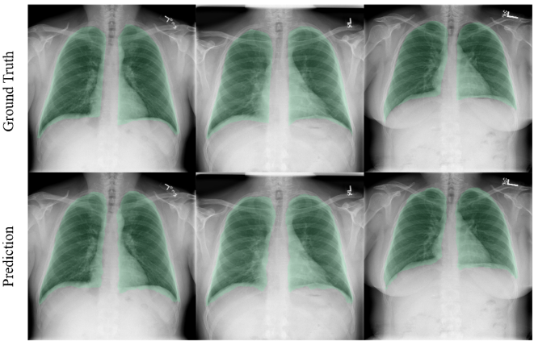
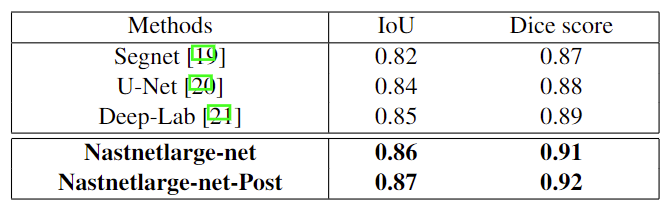

# Lung_Segmentation

This directory contains a small lung segmentation dataset and the code for paper [Lung segmentation with NASNet-Large-Decoder Net](https://arxiv.org/pdf/2303.10315.pdf).


If you have any questions, please email to youshan.zhang@yu.edu.
### Reference

If you find it is helpful, please cite it as:

`
Zhang, Youshan. (2023). Lung segmentation with NASNet-Large-Decoder Net. arXiv preprint arXiv:2303.10315.
`

`
Zhang, Y., Davison, B. D., Talghader, V. W., Chen, Z., Xiao, Z., & Kunkel, G. J. (2021, November). Automatic head overcoat thickness measure with NASNet-large-decoder net. In Proceedings of the Future Technologies Conference (pp. 159-176). Springer, Cham.
`

Or in bibtex style:

```

@article{zhang2023lung,
  title={Lung segmentation with NASNet-Large-Decoder Net},
  author={Zhang, Youshan},
  journal={arXiv preprint arXiv:2303.10315},
  year={2023}
}

@inproceedings{zhang2022automatic,
  title={Automatic head overcoat thickness measure with NASNet-large-decoder net},
  author={Zhang, Youshan and Davison, Brian D and Talghader, Vivien W and Chen, Zhiyu and Xiao, Zhiyong and Kunkel, Gary J},
  booktitle={Proceedings of the Future Technologies Conference (FTC) 2021, Volume 2},
  pages={159--176},
  year={2022},
  organization={Springer}
}
```  
  
  
The lung dataset is available at [this link](https://drive.google.com/file/d/1DUlkaMCJzSMxrf_gMP1aQaVn6Vmt-3mi/view?usp=sharing).


<p align="center">
   
</p>
<p align="center"> Ground truth VS prediction results</p>


<p align="center">
   
</p>
<p align="center"> Segmentation results comparison </p>
